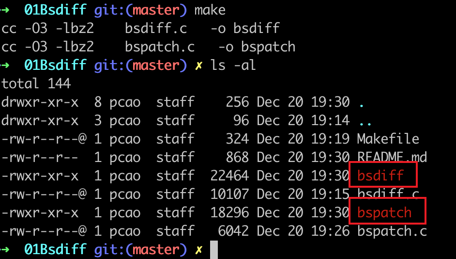

# bsdiff

## AOSP's bsdiff refer [here](https://android.googlesource.com/platform/external/bsdiff/)
## bsdiff origin source code refer [here](http://www.daemonology.net/bsdiff/bsdiff-4.3.tar.gz)

# bspatch

## same as **badiff**

# APPENDIX

## two bugs that can't build mac os binary execute  file
### change `Makefile` to below
        CFLAGS		+=	-O3 -lbz2
        
        PREFIX		?=	/usr/local
        INSTALL_PROGRAM	?=	${INSTALL} -c -s -m 555
        INSTALL_MAN	?=	${INSTALL} -c -m 444
        
        all:		bsdiff bspatch
        bsdiff:		bsdiff.c
        bspatch:	bspatch.c
        
        install:
        	${INSTALL_PROGRAM} bsdiff bspatch ${PREFIX}/bin
        	.ifndef WITHOUT_MAN
        	${INSTALL_MAN} bsdiff.1 bspatch.1 ${PREFIX}/man/man1
        	.endif

### change `bspatch.c` as below

    #ifdef __APPLE__
    #include <sys/types.h>
    #endif

# build

